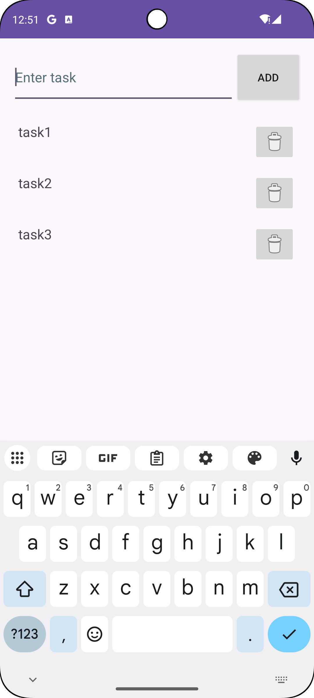

# 📝 ToDoList Android App

A simple yet efficient **To-Do List** app developed in **Java** and **XML** using **Android Studio**. This app allows users to manage tasks with a clean, intuitive interface and supports light and dark themes.

---

## 🚀 Features

- ➕ Add tasks
- 🗑️ Delete tasks


---

## 📸 Screenshots

<p align="center">
  
  
</p>

---
## 🛠️ Tech Stack

- **Language:** Java
- **UI Design:** XML
- **Database:** SQLite
- **IDE:** Android Studio

---

## ✅ Sample Task Usage

- "Buy groceries"
- "Finish assignment by Friday"
- "Call Mom at 5 PM"
- "Review pull requests"

---
## 📥 Getting Started

1. Clone the repository:
   ```bash
   git clone https://github.com/Aryan4297/PRODIGY_AD_02.git
2. Open the project in Android Studio.
3. Connect your emulator or device and click Run.
---

## 🤝 Contributing
Contributions are welcome! Feel free to open issues or pull requests.

---
## 👤 Author
- Aryan Jadhav
- 📧 aryanjadhav4297@gmail.com
- 🔗LinkedIn Post - https://www.linkedin.com/posts/aryan-jadhav-6b4891274_learningbybuilding-androiddev-studentproject-activity-7346818400410603520-WpwJ?utm_source=share&utm_medium=member_desktop&rcm=ACoAAEMMw6gBRs0KBy3dgxSLHPz1aiBjg1MiwcM
- 🔗LinkedIn Account- https://www.linkedin.com/in/aryan-jadhav-6b4891274